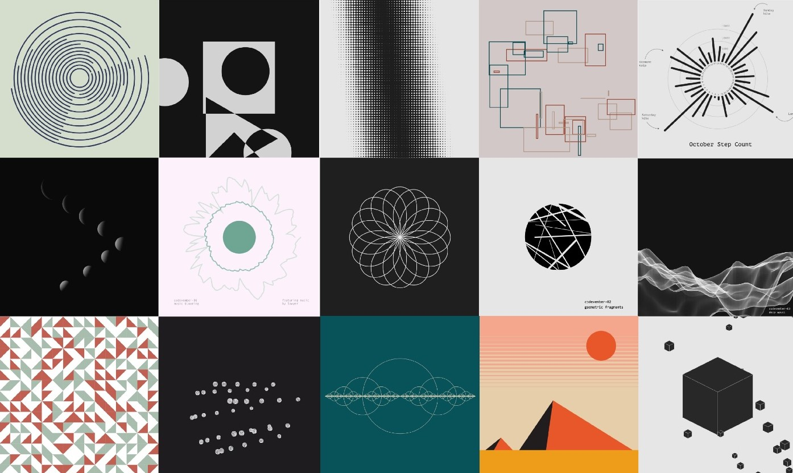

# Creative coding

An app that tracks progress of my creative coding skills. Mostly recreating websites that are [awwwards](https://www.awwwards.com/)-like.

## Technologies

I want to keep it stupid simple and see how far I can go with just native browser APIs without using many libraries (Or at least not at the beginning). For now, I'm using:

- Next.js
- React.js
- Sass
- TypeScript
- To be continued...

## Contact

If you want to suggest me something then reach out to me at one of the following places!

- Email: [kamiltroczewski@gmail.com](mailto:kamiltroczewski@gmail.com)
- Discord: mrkamiloox#7203
